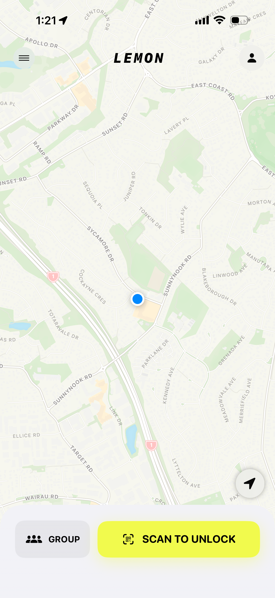
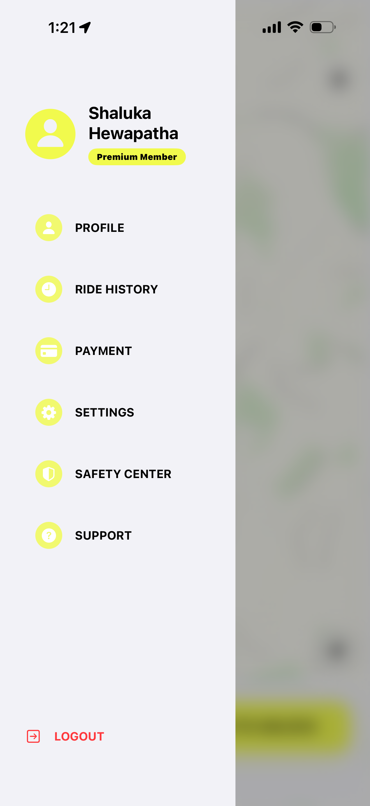
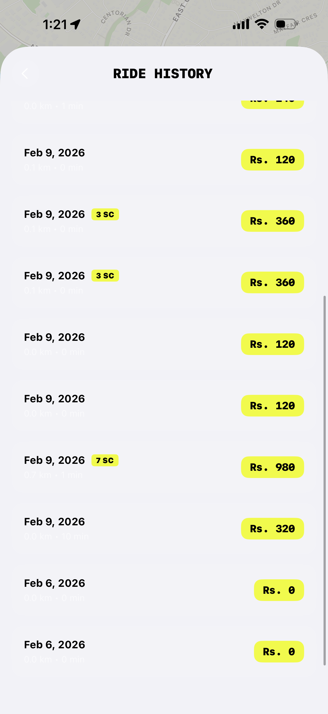
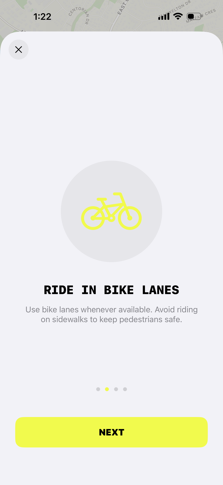

# 🍋 Lemon - Urban Mobility Reimagined

Lemon is a modern, high-performance scooter-sharing application designed for seamless urban mobility. Built with **SwiftUI** and powered by **Firebase**, Lemon provides a premium user experience from discovery to destination.

## 📱 Key Features

- **🗺️ Interactive Map**: Discover nearby scooters in real-time with an intuitive, responsive map interface.
- **🔓 Scan to Unlock**: Instant access to your ride with integrated QR code scanning.
- **🛡️ Safety First**: Integrated safety guidelines and a dedicated Safety Center to ensure every ride is secure.
- **💳 Digital Wallet & Payments**: Manage your balance with a seamless top-up system and transparent pricing in local currency (**Rs.**).
- **📊 Extended Ride History**: Keep track of your past trips, costs, and routes at a glance.
- **🌟 Premium Membership**: Unlock exclusive benefits and tailored experiences for frequent riders.

## 🖼️ Screenshots

  <table border="0">
    <tr>
      <td align="center"><b>Home & Map</b></td>
      <td align="center"><b>User Menu</b></td>
      <td align="center"><b>Ride History</b></td>
    </tr>
    <tr>
      <td></td>
      <td></td>
      <td></td>
    </tr>
    <tr>
      <td align="center"><b>Wallet & Payment</b></td>
      <td align="center"><b>Safety Instructions</b></td>
      <td align="center"><b>Onboarding</b></td>
    </tr>
    <tr>
      <td></td>
      <td></td>
      <td></td>
    </tr>
  </table>

## 🛠️ Tech Stack

### Frontend (iOS)
- **SwiftUI**: Modern, declarative UI framework.
- **Firebase SDK**: Handles Authentication, Realtime Database, and Cloud Firestore.
- **CoreLocation**: Precise geolocation and map interactions.

### Backend & Tooling
- **Firebase Functions**: Powers complex logic like ride initiation and cost calculations.
- **H3-js**: Hexagonal hierarchical geospatial indexing system for efficient scooter discovery.
- **Node.js**: Powers the scooter simulator and data generation scripts.

## 🚀 Getting Started

### Prerequisites
- macOS with Xcode 15.0+
- A Firebase project with iOS app support configured.
- `firebase-tools` installed via npm if managing backend functions.

### Setup Instructions
1. Clone the repository.
2. Ensure you have a `GoogleService-Info.plist` file in the `Lemon/` project root.
3. Open `Lemon.xcodeproj` in Xcode.
4. Build and run on a simulator or a physical device.

---

> [!TIP]
> **Scooter Simulation**: To test map features without physical hardware, run the included `scootersim.js` or `scooter_simulator.html` to generate live mock scooter data in your Firebase database.
